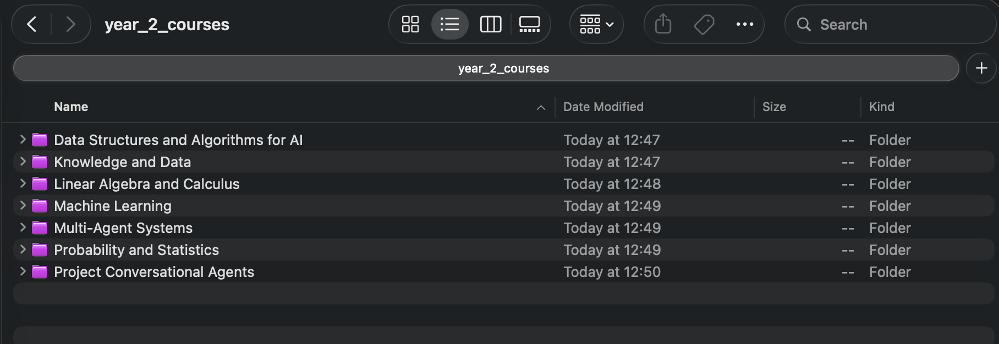
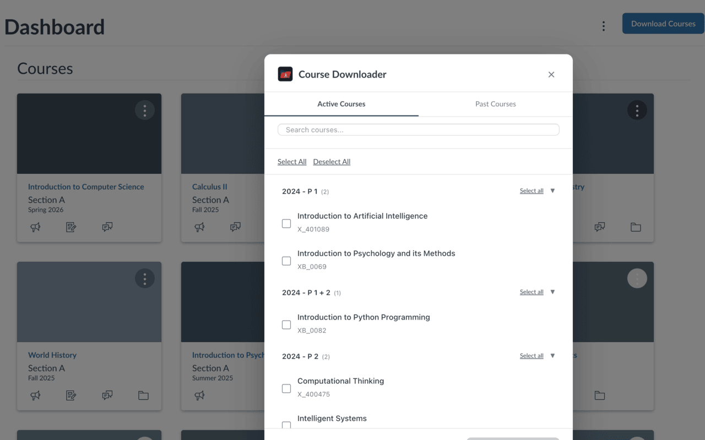

<p align="center">
  
</p>

<h1 align="center">Canvas Course Downloader</h1>

<p align="center">
  <strong>Browser extension that bulk-downloads your Canvas LMS courses.</strong><br>
  <sub>Works on Chrome, Edge, Firefox, Brave, and other Chromium-based browsers.</sub>
</p>

<p align="center">
  <a href="https://hits.sh/github.com/jasp-nerd/canvas-course-downloader/"></a>
</p>

<p align="center">
  <a href="#features">Features</a> &nbsp;&bull;&nbsp;
  <a href="#installation">Installation</a> &nbsp;&bull;&nbsp;
  <a href="#usage">Usage</a> &nbsp;&bull;&nbsp;
  <a href="#supported-content">Supported Content</a> &nbsp;&bull;&nbsp;
  <a href="#permissions">Permissions</a> &nbsp;&bull;&nbsp;
  <a href="#troubleshooting">Troubleshooting</a> &nbsp;&bull;&nbsp;
  <a href="#contributing">Contributing</a>
</p>

---

## Why?

Canvas courses can disappear after a semester ends. Downloading files one at a time takes forever when you have hundreds across multiple courses, and the existing tools out there all need API tokens or Python.

This extension skips all that. Open Canvas, click a button, and it downloads every file, page, assignment, announcement, discussion, module, and syllabus into organized folders. It uses your existing session cookies, so there's nothing to set up.

## Features

- Download all content from a single course page, or select multiple courses from your dashboard
- Switch between **active** and **past** courses in the course selector
- **ZIP bundling** — optionally bundle each course into a single `.zip` file
- **Incremental mode** — only download new files on subsequent runs
- **Grades export** — download your grades as a CSV file
- Finds files linked inside assignments, pages, announcements, and discussions that don't show up in the file browser
- Saves everything into organized subfolders per course (see [folder structure](#exported-folder-structure))
- **Configurable** — choose which content types to export, set download throttling, conflict handling, and more
- Works with any Canvas LMS instance (Instructure-hosted or self-hosted) on macOS, Windows, and Linux
- Keyboard shortcut: <kbd>Ctrl+Shift+D</kbd> (Mac: <kbd>Cmd+Shift+D</kbd>)
- No API keys needed
- Runs entirely in your browser; nothing is sent to external servers

## Screenshots

### Bulk download result
All courses organized into folders:



### Course selector
Pick which courses to download from your Canvas dashboard:



## Installation

### Chrome / Edge / Brave (developer mode)

1. Clone this repository:
   ```bash
   git clone https://github.com/jasp-nerd/canvas-course-downloader.git
   ```
2. Open your browser's extension page:
   - Chrome: `chrome://extensions`
   - Edge: `edge://extensions`
   - Brave: `brave://extensions`
3. Enable **Developer mode** (toggle in the top-right corner)
4. Click **Load unpacked** and select the cloned folder
5. Go to your Canvas LMS site and you're good to go

### Firefox (developer mode)

1. Clone this repository
2. Open `about:debugging#/runtime/this-firefox`
3. Click **Load Temporary Add-on** and select the `manifest.json` file
4. Go to your Canvas LMS site

### Web stores

*Coming soon for Chrome Web Store and Firefox Add-ons.*

## Usage

### Single course

1. Go to any Canvas course page
2. Click the **"Download Course Content"** button in the breadcrumb bar
3. The extension grabs everything and downloads it into folders

### Multiple courses

1. Go to your Canvas dashboard (homepage)
2. Click **"Download Courses"** in the header
3. Switch between **Active** and **Past Courses** tabs
4. Check the courses you want
5. Click **"Download Selected"** and wait for the progress bar to finish

### Settings

Click **Settings** in the extension popup (or go to the extension's options page) to configure:

- **Content types** — choose which types to export (files, pages, assignments, etc.)
- **Presets** — quick-select common configurations (full archive, files only, text only)
- **File conflict handling** — uniquify, overwrite, or skip duplicate filenames
- **Download throttle** — control the delay between downloads (default: 250ms)
- **Folder prefix** — add a custom prefix to all download paths
- **ZIP bundling** — bundle each course into a single `.zip` instead of individual files
- **Incremental mode** — skip files that were already downloaded in previous runs

## Supported content

| Content Type   | What gets downloaded                                         |
| -------------- | ------------------------------------------------------------ |
| Files          | All files from the course file browser, kept in their folders |
| Pages          | Every page saved as HTML                                     |
| Assignments    | Assignments with descriptions and due dates (HTML)           |
| Announcements  | Course announcements with dates (HTML)                       |
| Discussions    | Discussion topics with author info (HTML)                    |
| Modules        | Module structure overview and any files linked within them   |
| Syllabus       | The course syllabus as HTML                                  |
| Grades         | Assignment scores exported as CSV                            |
| Hidden files   | Files embedded in assignments, pages, or announcements       |

## Exported folder structure

Each course is downloaded into its own folder. Here's what the output looks like:

```
Course Name/
├── Files/                    # All files from the course file browser
│   ├── Lecture Slides/       #   (preserves the original folder structure)
│   │   ├── week1.pdf
│   │   └── week2.pdf
│   └── Readings/
│       └── chapter1.pdf
├── Pages/                    # Every wiki page as HTML
│   ├── course-overview.html
│   └── resources.html
├── Assignments/              # Each assignment as HTML (with description & due date)
│   ├── Homework-1.html
│   └── Final-Project.html
├── Announcements/            # Each announcement as HTML
│   └── Welcome-to-class.html
├── Discussions/              # Each discussion topic as HTML
│   └── Introduce-yourself.html
├── Modules/                  # Files referenced in modules (not already in Files/)
│   └── Week 1/
│       └── handout.pdf
├── Extracted_Files/          # Hidden files found in page/assignment HTML
│   └── embedded-image.png
├── Modules.html              # Module structure overview
├── Syllabus.html             # Course syllabus
├── Grades.csv                # Your grades (if enabled)
└── manifest.json             # Export metadata (date, counts, extension version)
```

> **Note:** When using ZIP mode, the entire course is bundled into a single `Course Name.zip` file with the same internal structure.

## Permissions

This extension requests broad page access (`https://*/*`) because Canvas LMS can be hosted on **any domain** — not just `instructure.com`. Universities often run Canvas on their own domains (e.g. `canvas.university.edu`). The extension needs to inject its content script on every HTTPS page to detect whether the site is a Canvas instance.

**What the extension does:**

- Detects Canvas pages by checking for Canvas-specific DOM elements and API endpoints
- Makes API calls to the Canvas REST API using your existing session cookies
- Downloads files through Chrome's built-in download manager

**What the extension does NOT do:**

- Collect, store, or transmit any personal data
- Make requests to any server other than the Canvas instance you're on
- Run on non-Canvas pages (detection exits immediately if Canvas is not found)
- Access any data outside of the Canvas API

For the full privacy policy, see [PRIVACY.md](PRIVACY.md).

## Known limitations

- **LTI content and external tools** — content hosted by third-party integrations (Turnitin, Panopto, external videos) cannot be downloaded since it lives outside Canvas
- **Active login required** — the extension uses your session cookies, so you must be logged into Canvas. There is no headless/API-token mode
- **Institution customizations** — heavily customized Canvas themes may affect button injection or page detection
- **HTML summaries** — pages, assignments, announcements, and discussions are exported as HTML summaries, not pixel-perfect copies of the original layout
- **Large courses** — courses with hundreds of files may take several minutes to process
- **Browser download limits** — some browsers limit concurrent downloads; the extension throttles to avoid this, but you may see warnings

## Troubleshooting

**"Not on a Canvas page"**
The extension didn't detect Canvas on the current page. This can happen on self-hosted instances with non-standard themes. Make sure you're on a page that has Canvas navigation elements. Try clicking the extension icon directly from a Canvas course page.

**"Course selector is empty"**
No courses were returned by the API. Check that you have active enrollments, or try the **Past Courses** tab for completed semesters. Some institutions restrict API access for certain roles.

**"Downloads blocked by browser"**
Your browser may block bulk downloads. When prompted, click **Allow** to let the extension download multiple files. You can also reduce the download throttle in settings if downloads are timing out.

**Self-hosted Canvas not detected**
The extension detects Canvas by looking for specific DOM elements (`#application`, `.ic-app`, etc.). If your institution's Canvas has a heavily customized theme, detection may fail. File an issue with your Canvas URL structure and we can investigate.

**Firefox temporary addon expired**
Firefox temporary add-ons only last until the browser is restarted. Reload the extension from `about:debugging#/runtime/this-firefox` → **Load Temporary Add-on**.

**Some files are missing**
Files in restricted areas or behind additional permission checks may not be accessible through the API. Files hosted by external LTI tools won't be captured. Check the browser console for specific error messages.

## Project structure

```
canvas-course-downloader/
├── manifest.json      # Extension manifest (MV3)
├── helpers.js         # Pure utility functions (sanitization, parsing, colors)
├── detector.js        # Canvas page/course detection
├── canvas-api.js      # Canvas REST API helpers (fetch, pagination, retry)
├── ui.js              # UI components (toast, progress panel, course selector, buttons)
├── downloader.js      # Download orchestration, ZIP bundling, settings
├── content.js         # Entry point: initialization, SPA handling, message routing
├── background.js      # Service worker: sequential download queue
├── popup.html/js      # Extension popup UI
├── options.html/js    # Settings page
├── jszip.min.js       # JSZip library for ZIP bundling
├── tests/
│   └── test-helpers.html  # Browser-based unit tests for pure helpers
└── icons/
    └── icon.svg       # Extension icon
```

## How it works

The content script checks if the current page is a Canvas site by looking for Instructure domains and Canvas-specific DOM elements. If it is, the extension uses the Canvas REST API with your existing session cookies (no API token) and handles pagination automatically.

Beyond the normal file list, it also parses HTML from pages, assignments, and announcements to find linked files that aren't in the file browser. Files get sent to the background service worker, which downloads them one at a time with throttling so it doesn't overwhelm the browser.

## Contributing

Contributions are welcome! See [CONTRIBUTING.md](CONTRIBUTING.md) for guidelines.

## License

[MIT](LICENSE)
